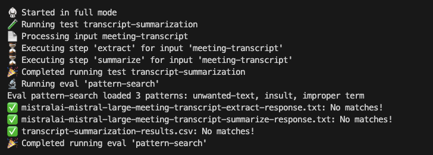

# 🥋 KataPrompt - A Toolkit for Test-Driven Quality Prompt Engineering

### Introduction

KataPrompt is a toolkit for test-driven style prompt engineering and general prompt-fu to help humans craft high-quality prompts and inputs for LLMs in a simple, straightforward, low-code, zen-like way.

## Overview

KataPrompt a toolkit for test-driven prompt engineering using that helps you create & test prompts quickly and lets you evaluate and compare outputs from language models, refine your prompts, detect problems early, and improve prompt quality.
It also contains a basic framework for writing simple evals to analyze outputs from your tests.

## Key features include:

* Provides a set of tools to aid in writing high-quality prompts using test-driven development principles.
* Fully configurable using YAML config files without need to write code.
* Allows developers to run, test and evaluate prompts systematically against predefined cases.
* Generates output to text and CSV files for easy reporting and comparison.
* Allowing you to change and mix and match models via config.
* Supports single-step and multi-step generation (eg. completion, Q&A, extract & summarize, summarize & translate etc.)
* Comparing outputs from different models side by side.
* Supports WatsonX platform enabling access to muliple LLM models (Llama, Mistral etc.).
* (WIP) Enabling scoring of outputs based on defined expectations/evals.
* (WIP) It can be used as a command-line tool or integrated into your workflow/CI/CD as a library.
* (WIP) Speeding up evaluations using caching and running tests concurrently.

### Usage

1. Clone this repository.
2. Install dependencies: `npm install`.
3. Create a `.env` with your credentials (see .env.sample for info).
4. Add your prompts and inputs under `/inputs` (see sample config under inputs folder).
5. Create a config based on your inputs (see sample-config.yaml for an example).
6. Run `npm start {CONFIG_FILE}` and profit 🥷💸

#### Additional usage options:
1. Run `npm start test {CONFIG_FILE}` to execute tests.
2. Run `npm start eval {CONFIG_FILE}` to execute evals.
3. Run `npm start full {CONFIG_FILE}` to execute tests followed up by evals.
4. Run `npm run tdd {CONFIG_FILE}` to run in test-driven mode with hot-reloading of tests and evals on upon any changes

### Contributing

*   Fork this repository
*   Create a new branch for your feature or bug fix
*   Commit changes with meaningful commit messages
*   Open a pull request to the main branch

### License

This project is licensed under the MIT License.

### Future plans
* Support for input pre-processors (chunking, character normalization, etc.)
* Additional evals
* Support additional API providers via LangChain
* Possibly support embedding into popular testing frameworks (Jest, Mocha, etc.)
* Support additional output format and customization (JSON, XML)

### Credits

Created by w0o @ 2024
